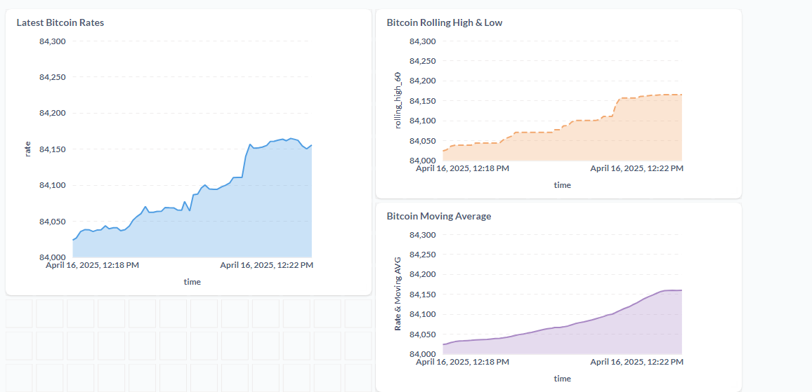

# 

# Real-Time Bitcoin Dashboard - Data Engineering Project

This repo contains the final project for the [Data Engineering Zoomcamp](https://github.com/DataTalksClub/data-engineering-zoomcamp) course by DataTalksClub.

## Introduction

Bitcoin as a digital currency is notoriously volatile. This project aims to provide a real-time dashboard of Bitcoin's price rate in USD, coupled with a moving average and rolling high statistics for a better intuition into the currency's trends.

## Dataset

This project uses data from [coinapi.io](https://coinapi.io) REST API to acquire real-time rates for Bitcoin.

Each API response contains information about the timestamp, currency, and rate (value).

## Tools

The following tools were used to make the project:

* Containerization: Docker

* Workflow Orchestration: Kestra

* Realtime Data Streaming: Apache Kafka

* Database: Postgresql

* Data Transformation: DBT

* Data Visualization: Metabase

## Operation

* A Docker container of each tool is started. 

* Using Kestra flows, Kafka producer and consumer python scripts are started.

* The Kafka producer queries the Coinapi's REST API to retrieve Realtime data.

* The Kafka producer writes the response to a Kafka topic.

* The Kafka Consumer consumes data from the topic, then writes to a Postgres table.

* Using another Kestra flow, DBT transformations that calculate the moving average and the rolling high is executed.

* Metabase reads the Postgres tables and produces the corresponding dashboard plots.

## Screenshots

